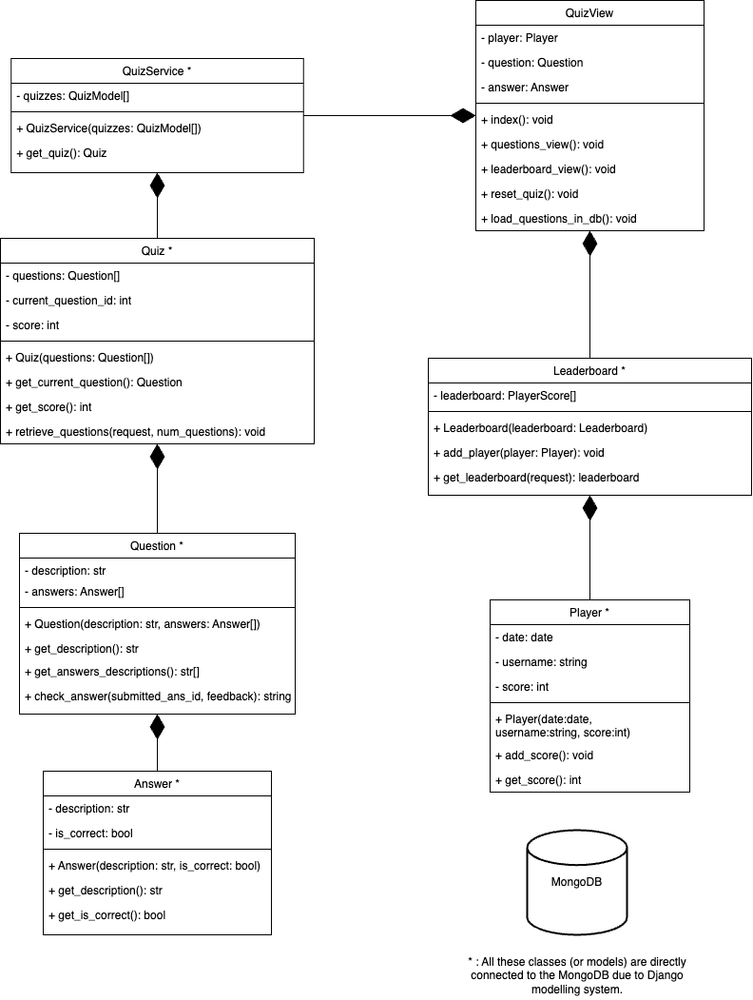

# Quiz App (Pablongo's)

## Team members
- Aleny Sofia Arévalo Magdaleno | A01751272
- Luis Humberto Romero Pérez | A01752789
- Valeria Martínez Silva | A01752167
- Pablo González de la Parra | A01745096
- David Damián Galán | A01752785

## General overview
The Pablongo's Quiz App is a web application that allows users to participate in quizzes by answering questions related to **design patterns** and **SOLID principles** and keeping track of their scores. Users can also view the leaderboard to see the top scorers, and reset the quiz to participate as many times as they want.

## Web Location
Please note that while the Quiz App can also be run locally, it is currently hosted in a **AWS EC2 instance**. The link to access it is:
```
http://54.162.170.59:8000/
```

The **MongoDB Database** is also hosted on a separate **Amazon EC2 instance**, and should only be accessed through the web app respectively. For security reasons, the address of the MongoDB instance is not listed in this README.md

In order to prove the functionality of the application hosted on a cloud server provider (in case of an error in the server), please access the following link.

[Video and Screenshot Demonstration of Quiz App hosted on AWS (Google Drive)](https://drive.google.com/drive/folders/1TOPbXmoKa-CxpHDU57gI539-TqItJ4c5?usp=sharing)

## Installation (Locally)

1. Clone the repository:

```
git clone https://github.com/your-username/quiz-app.git
```

2. Navigate to the project directory:

```
cd quiz-app
```

3. Create and activate a virtual environment:

```
python3 -m venv venv
source venv/bin/activate
```

4. Install the required dependencies:

```
pip install -r requirements.txt
```

5. Run the database migrations:

```
python manage.py migrate
```

6. Start the development server:

```
python manage.py runserver
```

7. Access the application at [http://localhost:8000](http://localhost:8000).

`NOTE`: It is important to note that to populate the local MongoDB database with questions, the following command must be uncommented from the `views.py` file (line 42), and the server must be restarted.
```
# Run only the first time. Then comment out.!!!
QuizViews.load_questions_in_db(QuizViews)
```

## Diagram(s) of the system and its constituent parts.


## Patterns used, SOLID principles and Architecture Patterns
- **Patterns**:
In order to for writing clear and concise code, we implemented some of the design patterns and best practices during this project. The code uses the design pattern **Singleton** in the Player model to ensure there is only one instance of the Player class. This makes it easy to access and modify the player's data throughout the entire application, through the implemented model that Django offers for DB manipulation. The code also follows the **Single Responsibility Principle**, where each model (Question, Answer, Player) has a specific role in managing its own data. This is notable throughout the whole application, as well as being present in the logical separation in between separate collections in the MongoDB.
- **SOLID Principles**: Additionally, the code partially adheres to the **Open/Closed Principle** by separating different concerns and allowing for easy extension without needing to modify existing code. 
This allows for the addition of new functionality or features by creating new models or modifying existing ones, rather than directly modifying the core implementation. One clear example id the type of questions that can be added.
- **Architecture Patterns**:
The code incorporates the TVC (Template View Controller) pattern, which is a variation of the MVC (Model-View-Controller) pattern, due to Django's strict logical separation of controllers. In this pattern, the views take charge of rendering the HTML templates, the controllers handle the business logic and user input, and the models represent the data and maintain the application's state. In this specific case, the QuizViews class functioned as the controller (with all the business logic), the templates for rendering the frontend functioned as the view, and the models where simply the models that Django (w/ djongo and mongoengine) let us model in the MongoDB database.

The code establishes a clear structure of responsibilities and supports flexible extension, which contributes to creating maintainable and scalable django project.

## Unit testing
In order test the program in order to guarantee the correct functionality of the general functions of this Django application, execute this next command in the project directory.
```
python manage.py test --settings=quiz_app.settings_test
```

## Routes
- **Index**: `/` (GET)
  - Displays the index page where users can enter the number of questions and their username to start the quiz.

- **Quiz**: `/quiz/` (GET, POST)
  - Displays a question and its answers. If the user submits an answer, it checks if it's correct and displays feedback. If there are more questions, it proceeds to the next question. Otherwise, it shows the final score.

- **Leaderboard**: `/leaderboard/` (GET)
  - Displays the leaderboard, showing the top 10 players ordered by score and upload date.

- **Reset Quiz**: `/reset_quiz/` (GET)
  - Resets the quiz by clearing the session data and redirects to the index page.

## Models
- **Player**
  - Represents a player with a username and score.

- **Question**
  - Represents a question with a description and a list of associated answers.

- **Answer**
  - Represents an answer with a description and a flag indicating if it's correct.

- **Quiz**
  - Represents a list of questions. It keeps track of the current question and the player's score.

- **QuizService**
  - Represents a list of quizzes. It provides methods to retrieve quizzes.

- **Leaderboard**
  - Represents a list of players. It allows adding new players and retrieving the top players based on their score and date.

## Additional Information
- The project uses Django as the web framework and MongoEngine as the object-document mapper (ODM) for MongoDB.
- The `QuizViews` class in `views.py` contains the main logic for handling requests and rendering templates.
- The project includes templates in the `templates` directory and static files in the `static` directory.
- The application uses session data to store the state of the quiz (e.g., current question, player ID).
- The leaderboard displays the top 10 players based on their scores and upload dates. Ties are handled by assigning ranks.

Feel free to modify and extend the project as per your requirements.

## License
This project is licensed under the [MIT License](LICENSE).